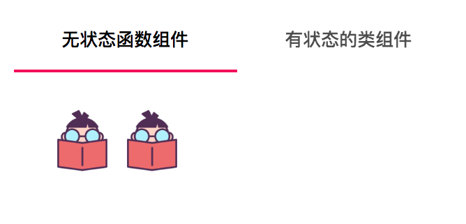

多数情况下，无状态的函数组件会用于一些纯粹的视觉展示，它可能是无操作的列表，甚至是一个无操作的按钮。根据以往的理解，在 TypeScript 的世界中，无状态函数组件被设计为 `React.SFC`，它只能接收 `props`，当然你也可以不传递 `props`。

```javascript
export const StaticButton: React.SFC = () => {
  return (
    <button>Static</button>
  );
};
```

```javascript
export const Header: React.SFC<IHeaderProps> = (props: IHeaderProps) => {
  const { localImageSrc, onLineImageSrc } = props;
  return (
    <div className={styles["header-container"]}>
      
      
    </div>
  );
};
```

我们从范例中其实可以得到一个很明确的信息，无状态函数组件没有任何生命周期的方法，也不能使用 `setState` ，但是我们可以访问到 `context` ，通过 `context` 对象倒是可以处理一些比较棘手的场景。不过正常情况下，我们多数不会这样做，因为它真的特别麻烦。

```javascript
// 父组件
import * as React from "react";
import PropTypes from "prop-types";
import Header from "./components/Header";

class ReactPage extends React.Component {
  public static childContextTypes = {
    localImageSrc: PropTypes.string,
  };

  public getChildContext() {
    return {
      localImageSrc: "http://images.w3crange.com/welearnmore.png",
    };
  }

  public render() {
    return (
      <div>
        React Page
        <Header
          onLineImageSrc="http://images.w3crange.com/welearnmore.png"
        />
      </div>
    );
  }
}

export default ReactPage;
```

在父组件中要使用 `getChildContext` 必须定义 static childContextTypes，并且在子组件中定义同样的 contextTypes：

```javascript
import * as React from "react";
import PropTypes from "prop-types";
import { IHeaderProps } from "./types";
import styles from "./style.css";

const Header: React.SFC<IHeaderProps> = (props: IHeaderProps, context: any) => {
  const { onLineImageSrc } = props;
  return (
    <div className={styles["header-container"]}>
      
      
    </div>
  );
};

Header.contextTypes = {
  localImageSrc: PropTypes.string,
};

export default Header;
```

一一对应，缺一不可。



无状态函数组件比较正确的做法是在很复杂的组件设计中，去分割一些更细小的组件，这样会有助于你组件的代码设计。